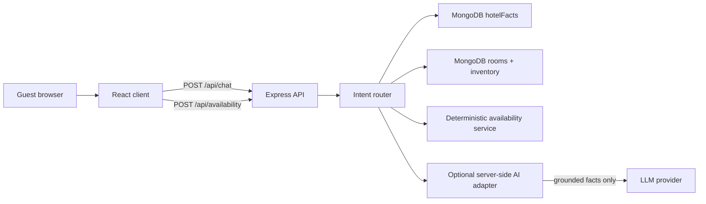

# Architecture

```mermaid
flowchart LR
  Guest[Guest browser] --> React[React client]
  React -->|POST /api/chat| Express[Express API]
  React -->|POST /api/availability| Express
  Express --> Router[Intent router]
  Router --> Facts[MongoDB hotelFacts]
  Router --> Rooms[MongoDB rooms + inventory]
  Router --> Availability[Deterministic availability service]
  Router --> AI[Optional server-side AI adapter]
  AI -->|grounded facts only| Provider[LLM provider]
```

Availability is authoritative only when returned by the deterministic service. The model can make grounded prose more natural but cannot invent inventory, dates, prices, or policy.
